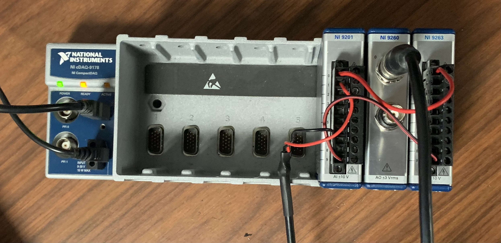

# Dynamic Signal Reproduction
A hardware-in-the-loop setup for reporducing dynamic signals.

## [Dynamic Signal Reproduction](dynamic_signal_reproduction)
1. A LabVIEW VI for the real-time reproduction of signals

## [Error Measurement](error_measurement)
1. A code developed for measuring the error of the generated signals. 

## Hardware :

cDAQ-9178 with NI 9201 card in slot 6, NI 9260 in slot 7, and NI 9263 in slot 8. In testing mode, A0 of the NI 9263 is wired to A0 of the NI 9201, and A0 of the 9260 is wired to A1 of the NI 9201.

Figure 1: Experimental setup

## Error Analysis
Using the analog-in NI 9201 card, we can test error of the system. We also notice that there is some time-drift from the NI 9260 that is associated with its delta-sigma converter.

Using the DROPBEAR dataset, we find:

NI 9260: SNR = 37.66 dB.
NI 9263: SNR = 43.42 dB

Figure 2: Signal synthesis of the NI 9260

Figure 3: Signal synthesis of the NI 9263

