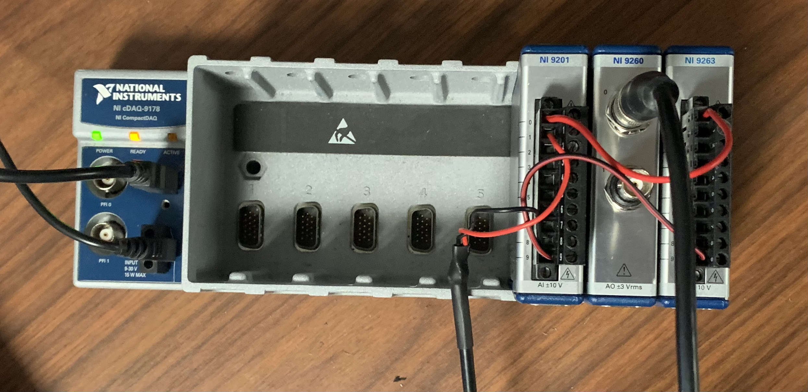

# Dynamic signal reproduction
A simple LabVIEW VI for the real-time reproduction of signals saved a .csv file.

## Run:
run 'dynamic signal generation.vi'.
Data is entered as a .csv that does not contain any line breaks. Within the VI, select "X file data" and navigate to the file you wish to reproduce. Within the VI, you have the option to select synthesis by using the NI 9260 in cDAQ slot 7 or the NI 9263 in cDAQ slot 8. You must also specify the synthesis rate. Scaling ratio is number which multiply your signal with to get the signal in volts. (So if your signal is already in volts, enter this value as one). If left as zero by default, the VI will scale the data to match the output range of the synthesis card. 

## Hardware :

cDAQ-9178 with NI 9201 card in slot 6, NI 9260 in slot 7, and NI 9263 in slot 8. In testing mode, A0 of the NI 9263 is wired to A0 of the NI 9201, and A0 of the 9260 is wired to A1 of the NI 9201.

Figure 1: Experimental setup

## Error Analysis
Using the analog-in NI 9201 card, we can test error of the system. We also notice that there is some time-drift from the NI 9260 that is associated with its delta-sigma converter.

Using the DROPBEAR dataset, we find:

NI 9260: SNR = 37.66 dB.
NI 9263: SNR = 43.42 dB

Figure 2: Signal synthesis of the NI 9260

Figure 3: Signal synthesis of the NI 9263

